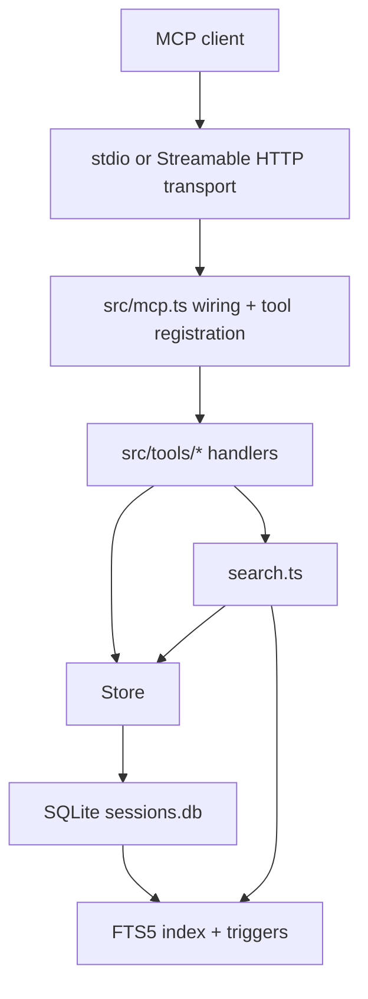

# Architecture

`debug-recorder-mcp` keeps runtime responsibilities intentionally narrow:

- MCP transports accept tool calls.
- Tool handlers translate those calls into store operations.
- `Store` owns SQLite persistence and import/export rules.
- `search.ts` combines SQLite FTS5 recall with Fuse.js reranking.

## Module map

- `src/mcp.ts`: runtime creation, shutdown handling, tool registration.
- `src/tools/session-tools.ts`: session lifecycle and context handlers.
- `src/tools/recording-tools.ts`: fix and command recording handlers.
- `src/tools/search-tools.ts`: search and similar-error handlers.
- `src/tools/admin-tools.ts`: stats, export, and import handlers.
- `src/store.ts`: repository-style DB access layer.
- `src/db.ts`: connection opening, pragmas, and schema migrations.

## Runtime notes

- File-backed databases use `WAL`, `synchronous = NORMAL`, `foreign_keys = ON`, and a 64 MB negative cache size hint.
- Search stays local and in-process; no external services are required.
- Import/export stays JSON-compatible with the existing MCP tools.

## Architecture decisions

- [ADR-0001: Local SQLite Storage and Versioned Migrations](./adr/0001-local-sqlite-storage-and-versioned-migrations.md)
- [ADR-0002: Hybrid FTS5 Recall with Fuse.js Reranking](./adr/0002-hybrid-fts5-and-fuse-search.md)
- [ADR-0003: Local-First Streamable HTTP Security Model](./adr/0003-local-first-streamable-http-security.md)
- [ADR-0005: MCP Registry Identity and Version Metadata](./adr/0005-mcp-registry-versioning-and-metadata.md)
